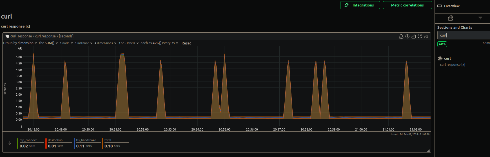

# Netdata custom curl collector (python)
This collector runs curl command on the host and charts the following [curl reported metrics](https://curl.se/docs/manpage.html):
- time_namelookup
- time_appconnect
- time_connect
- time_total

## Install
1. Copy files to the following folders:  
 - curl_request.chart.py -> /usr/libexec/netdata/python.d/
 - curl_request.conf  -> /etc/netdata/python.d/  

2. Add your desired job urls to the configuration file.  
3. If disabled, please enable python.d plugin in netdata configuration (/etc/netdata/netdata.conf):
```
[plugins]
        . . .
         python.d = yes
        . . .
```
4. Restart netdata: `sudo systemctl status  netdata`

## Add additional probes:
Adjust /etc/netdata/python.d/curl_request.conf. Add additional probe URLs and names.
```
google:
    name: "Google"      # the JOB's name as it will appear on the dashboard
    url: https://www.google.com

bing:
    name: "Bing"     
    url: https://www.bing.com
```



## Troubleshoot

```sh
# Switch to netdata user:
sudo -u netdata -s
# Execute the collector ad-hoc in debug mode:
/usr/libexec/netdata/plugins.d/python.d.plugin curl_request debug trace nolock
```
